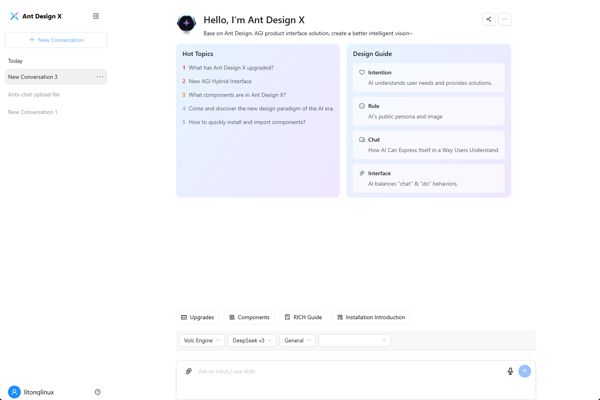

# tauri-qwen

通义千问大模型客户端,一个独立的桌面应用程序，用于 qwen，使用 Tauri 构建。



## 功能
* **原生体验**：直接从桌面与 qwen 交互，无需浏览器。
* **快速且轻量**：使用 Tauri 构建，应用程序资源占用少，启动迅速。
* **跨平台**：支持 Windows、macOS 和 Linux。

## 安装

### 预构建二进制文件
您可以从 [Releases](https://github.com/litongjava/tauri-qwen/releases) 页面下载适用于您平台的预构建二进制文件。

### 从源代码构建

1. 克隆此仓库：
    ```bash
    git clone https://github.com/litongjava/tauri-qwen
    ```
2. 进入项目目录：
    ```bash
    cd tauri-qwen
    ```
3. 安装 tauri：
    ```bash
    cargo install tauri-cli
    ```
4. 构建应用程序：
    ```bash
    cargo tauri build
    ```

## 使用

1. 启动应用程序。
2. 直接从应用程序界面与 qwen 交互。

## 缓存
缓存文件夹
- windows C:\Users\Administrator\AppData\Local\com.litongjava.tauri.qwen
## 贡献

欢迎提交 Pull Request！对于重大更改，请先打开一个问题以讨论您想要更改的内容。

## 许可证

[MIT 许可证](LICENSE)